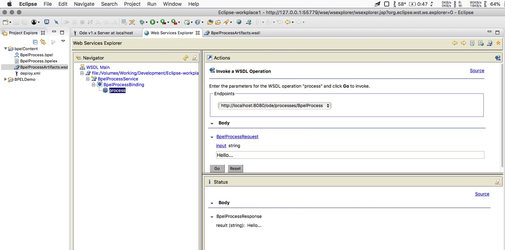
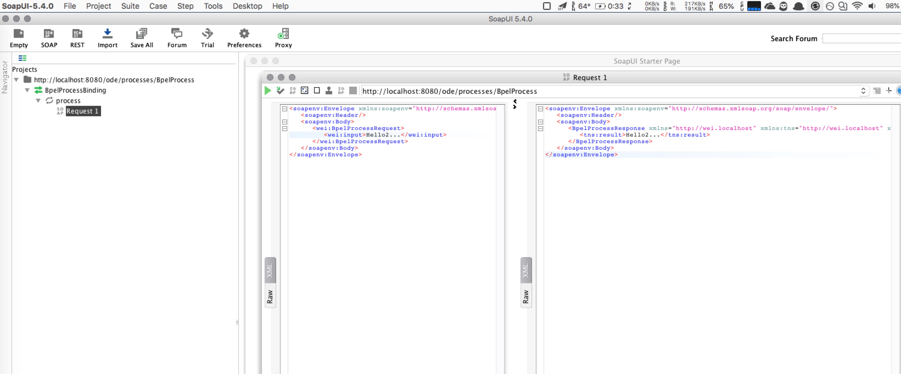

# A simple BPEL demo using Eclipse 


# Video Tutorial

- https://www.youtube.com/watch?v=4ftyrUE3Fj8


### Install BPEL in Eclipse

- See  **Installing Eclipse BPEL designer** part in  http://www-inf.int-evry.fr/cours/WebServices/TP_BPEL/installation.html
- https://www.youtube.com/watch?v=aVMu2bkRmig


### Install Apache ODE

- See  **Installing Apache ODE** part in  http://www-inf.int-evry.fr/cours/WebServices/TP_BPEL/installation.html


### Set up the ODE server on Eclipse

- See **Setting up the ODE server on Eclipse** part in  http://www-inf.int-evry.fr/cours/WebServices/TP_BPEL/installation.html


# After Deployment

- Visit Apache ODE: http://localhost:8080/ode/#/

- BPEL: http://localhost:8080/ode/processes/BpelProcess


# SOAP communication test

### 1 Test in Eclipse Web Service Explorer 



##### Request Envelope

```
<soapenv:Envelope xmlns:soapenv="http://schemas.xmlsoap.org/soap/envelope/" xmlns:q0="http://wei.localhost" xmlns:xsd="http://www.w3.org/2001/XMLSchema" xmlns:xsi="http://www.w3.org/2001/XMLSchema-instance">
  <soapenv:Body>
    <q0:BpelProcessRequest>
      <q0:input>Hello...</q0:input>
    </q0:BpelProcessRequest>
  </soapenv:Body>
</soapenv:Envelope>
```

##### Response Envelope

```
<soapenv:Envelope xmlns:soapenv="http://schemas.xmlsoap.org/soap/envelope/">
  <soapenv:Body>
    <BpelProcessResponse xmlns="http://wei.localhost" xmlns:tns="http://wei.localhost" xmlns:xsi="http://www.w3.org/2001/XMLSchema-instance">
  <tns:result>Hello...</tns:result>
</BpelProcessResponse>
  </soapenv:Body>
</soapenv:Envelope>
```

### Test in SoapUI



##### Request Envelope

```
<soapenv:Envelope xmlns:soapenv="http://schemas.xmlsoap.org/soap/envelope/" xmlns:wei="http://wei.localhost">
   <soapenv:Header/>
   <soapenv:Body>
      <wei:BpelProcessRequest>
         <wei:input>Hello2...</wei:input>
      </wei:BpelProcessRequest>
   </soapenv:Body>
</soapenv:Envelope>
```

##### Response Envelope

```
<soapenv:Envelope xmlns:soapenv="http://schemas.xmlsoap.org/soap/envelope/">
   <soapenv:Header/>
   <soapenv:Body>
      <BpelProcessResponse xmlns="http://wei.localhost" xmlns:tns="http://wei.localhost" xmlns:xsi="http://www.w3.org/2001/XMLSchema-instance">
         <tns:result>Hello2...</tns:result>
      </BpelProcessResponse>
   </soapenv:Body>
</soapenv:Envelope>
```

### 

# Reference

- http://www-inf.int-evry.fr/cours/WebServices/TP_BPEL/installation.html
- http://people.apache.org/~vanto/HelloWorld-BPELDesignerAndODE.pdf
- https://www.youtube.com/watch?v=L7wXShaoDmU&t=506s
